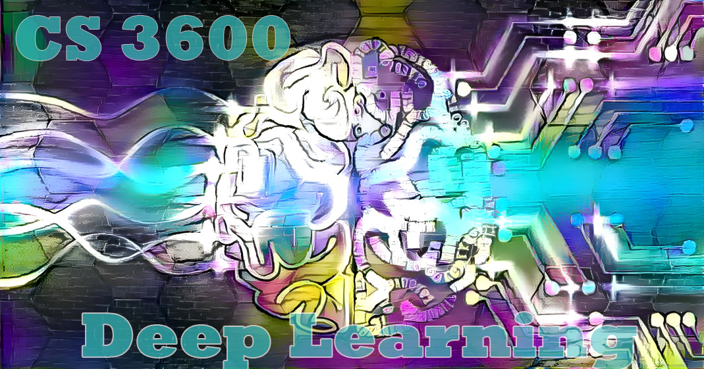

# Deep learning - tutorials (cs3600)
## Reichman University (former IDC), computer science department 
##
<h1 align="center">
  <br>
  
</h1>


## Run the notebooks
* install [miniconda](https://conda.io/miniconda.html) distribution of python3 using this [instruction](https://docs.conda.io/projects/conda/en/latest/user-guide/install/index.html)
* add conda to your bashrc:

```bash
echo "source $HOME/miniconda3/etc/profile.d/conda.sh" >> ~/.bashrc
```


* for windows dont forget to download [VS Build tool](https://visualstudio.microsoft.com/downloads/#build-tools-for-visual-studio-2019)

* create virtual env and activate it
```bash
 conda env update -f environment.yml
 conda activate cs3600
```


## Sylabus

|Tutorial       | Topics Covered |
|----------------|---------|
|T1| Getting started, python programing, numpy and pytorch basics with automatic difrentiation, logistic regression |

## License
released under the [MIT license](LICENSE).
